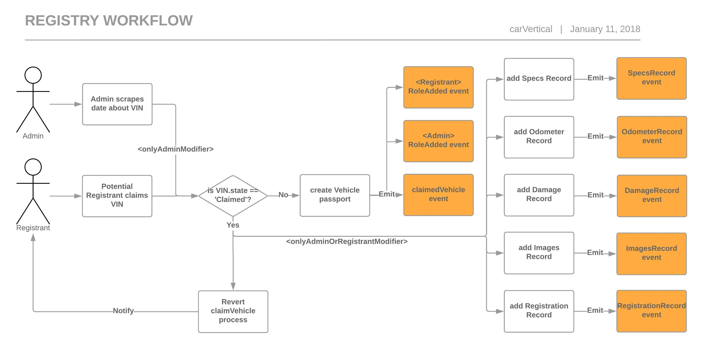

# Registry Contracts

An official carVertical repository for Vehicle, Registry and any additional supporting contracts. 

## Prerequisites and testing

* Make sure truffle and testrpc are installed on dev machine
* Start testchain `testrpc -m "one two three four five"`
* `truffle test --network local`

## Workflows

### Claiming a vehicle contract workflow

## Contacts

For any details or suggestions, please contact developers at [info@carvertical.com](mailto:info@carvertical.com) or raise an issue or GitHub project.
